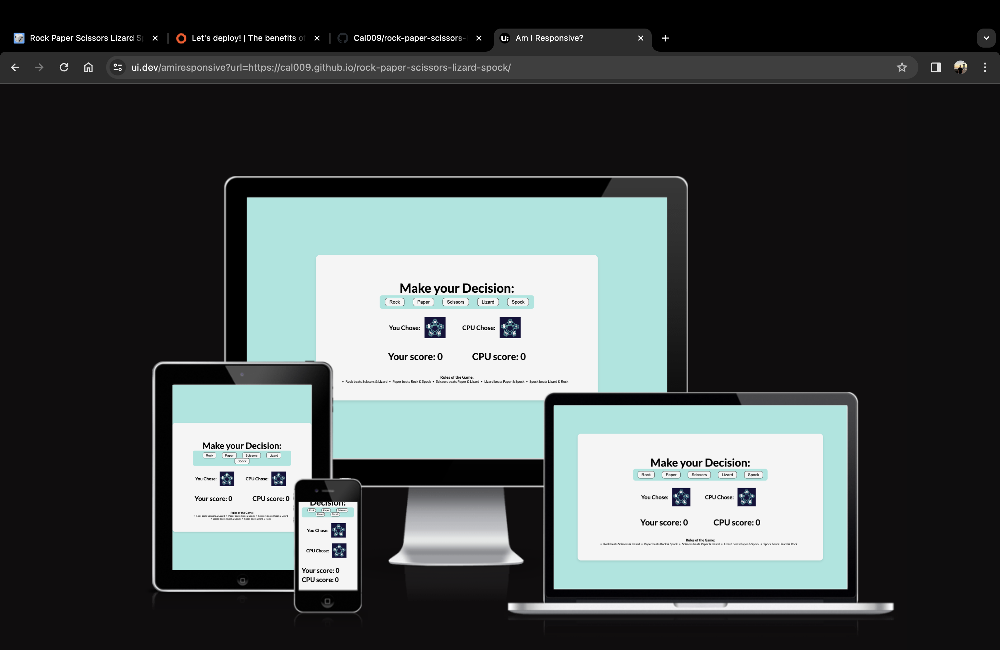
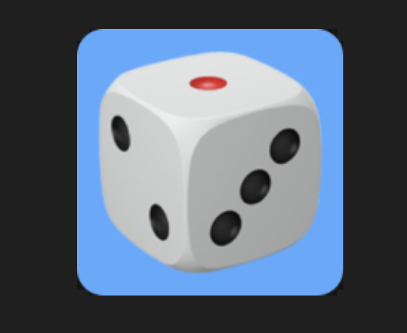
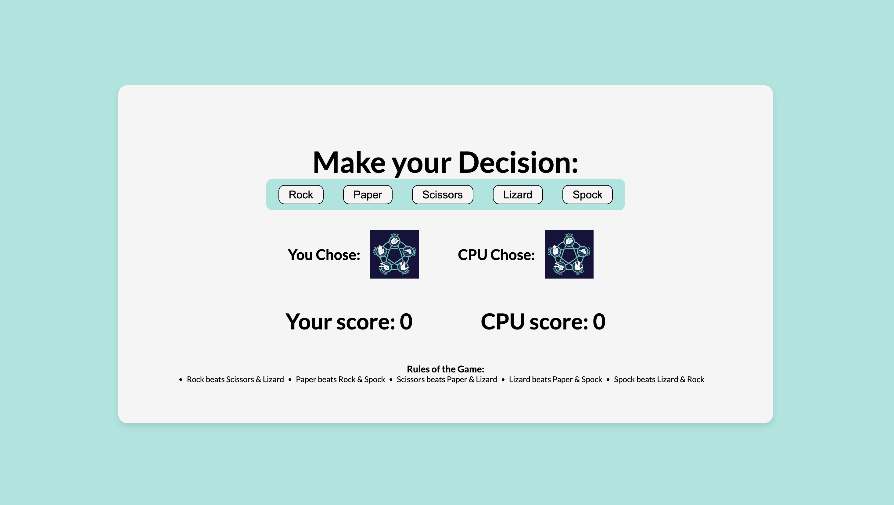
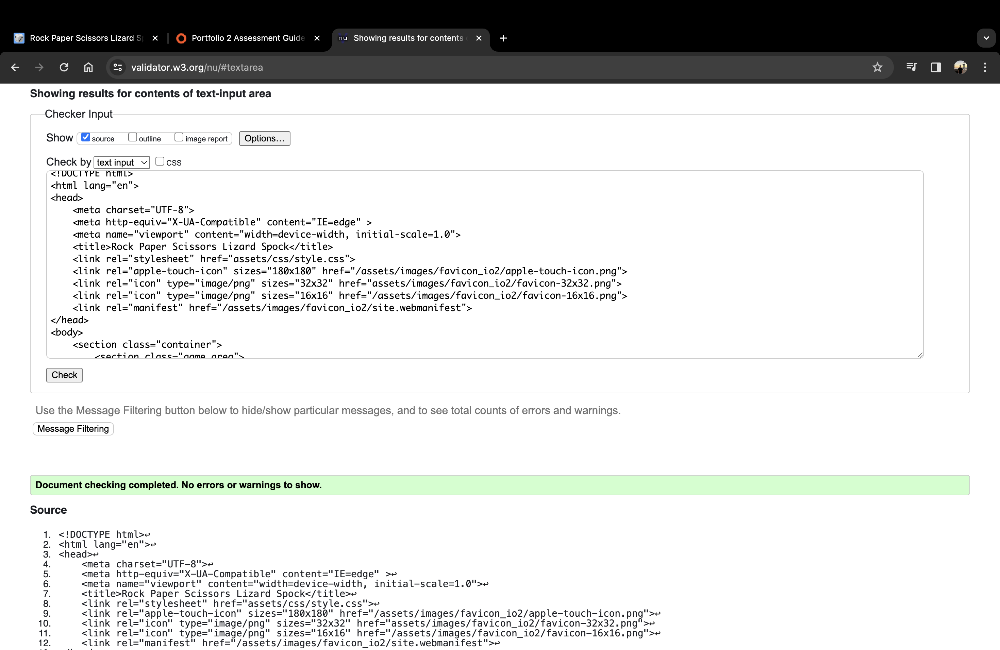
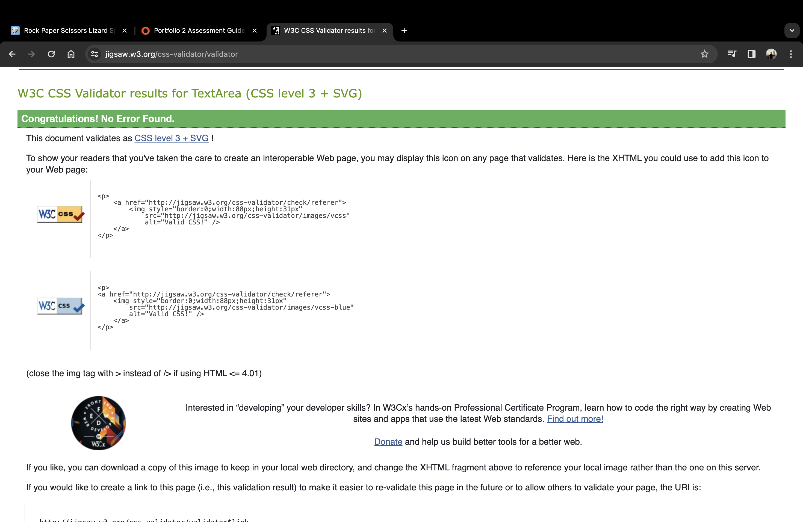
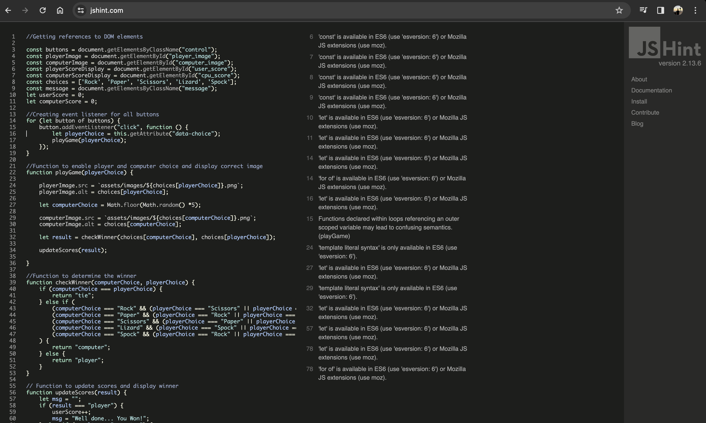
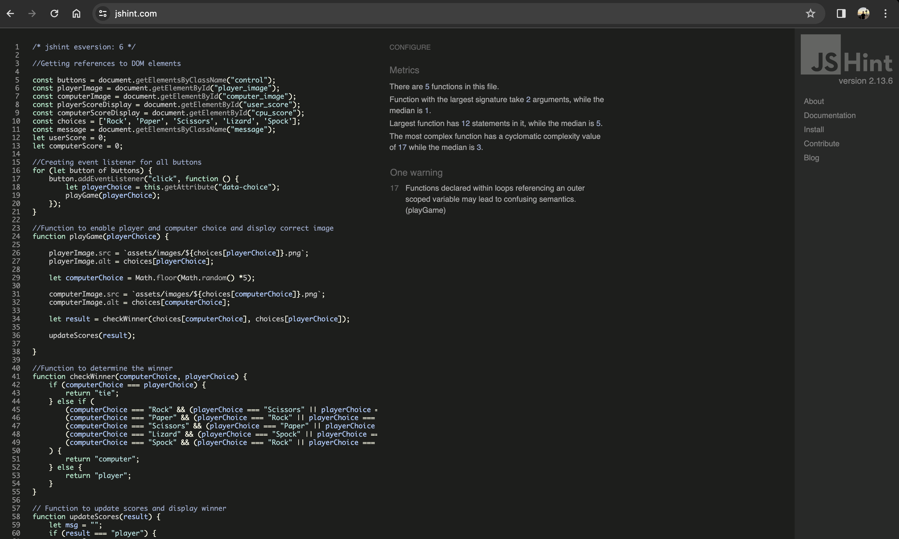

# My Rock Paper Scissors lizard Spock!

Rock Paper Scissors is a well known game played around the world due to its simple but addictive nature. Rock Paper Scissors Lizard Spock, takes what is great about the orignal game and enhances it with more chances to out play your opponent. The object of the game is to beat the opponent by selecting one of the 5 choices, hoping the opponent chooses one you can beat. The rules of the game are further explained in the footer of my website to avoid any confusion when playing.

You can access my website here [link] (https://cal009.github.io/rock-paper-scissors-lizard-spock/)

## Features

Each feature implemented into my website was executed with the user's goals and expectattions in mind. These features can be found below:

### Current Features

- __The Favicon__

- Featured within the HTML bar at the top of the page, the Favicon image matches the color scheme of the website. This was done to keep a sense of similarity would be confusin/random to the viewer of the website if there was no correlation.
- Futhermore the main image is of a dice. This was specifically chosen to represent the game and the element of chance involved.

- __The Game area__

- The first section of the game area gives a clear indication as to the focus of the game. Make a choice of which object you are going to select with each object clearly postioned in the center of the screen. The buttons also have a clear contrast to the background which further keeps the color design similar to the rest of the document.
- Below this you then have two clear sections for 'Your Choice' and the 'CPU Choice'. The reasoning behind adding this feature was to allow the user to see the choice they have made compared to the computers and then accurately update the scores after. A placeholder image was implemented to stay there explaining the game in a picture form before the player has made any choices.
- The scoring section is clearly shown by the larger font. The decision to do this was made as I wanted the user to see a clear seperation betweeen the information on the screen without adding too much color to the backgrounds for separation.
- Then from within the footer of the document is the rules of the game. For a lot of people the rules are not necessary as the game is very well known. However the choice was made to implement the rules to allow for everyone entering the site to have an equal chance at beating the computer.

- Finally the choice to have a blue background as well as the centered white box was to allow full focus on the game. The light blue color matches the light blue shown in the placeholder image for the choices.

## Testing

In order to make sure my website was running correctly and everything was error free I used multiple resources to check. These included:

- __W3C Validator__

- Upon checking this validator I had no issues with my code.

- __Jigsaw Validator__

- When checking the Jigsaw Validator everything came back with no errors.

- __JSHint Validator__

- When I checked the JSHint Validator I ran into an issue with multiple error codes all including the same code. I decided to run the code through the AI tool Chat GPT and it came back that it was a minor error with the version of JSHint. After putting in a comment to define the specific version of JSHint it came back with a single error code however this was only a warning and so was not changed. This can be shown below:

